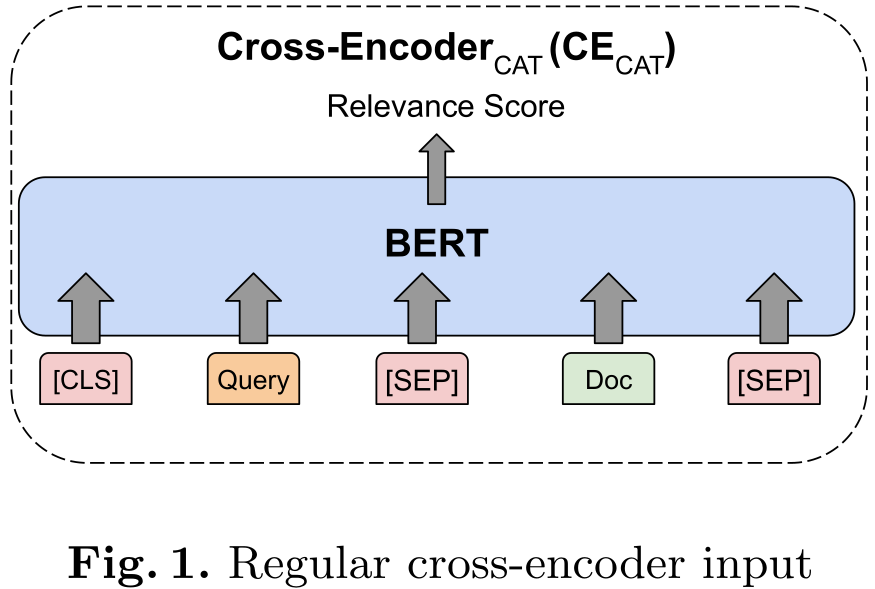
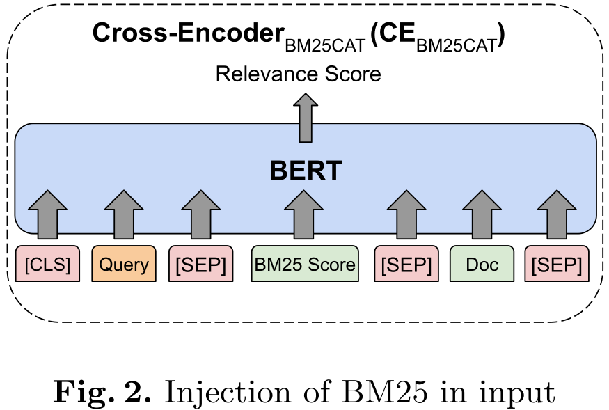
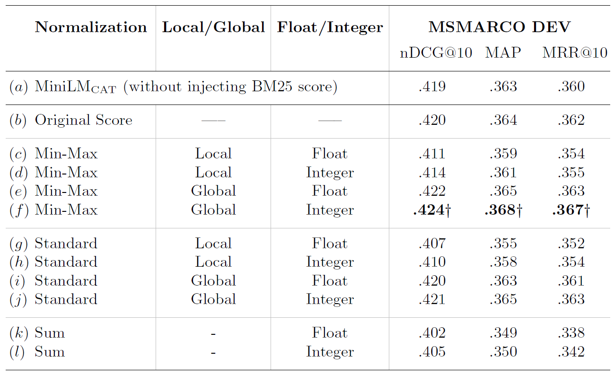
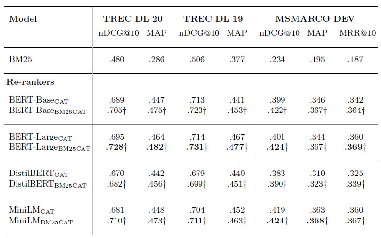
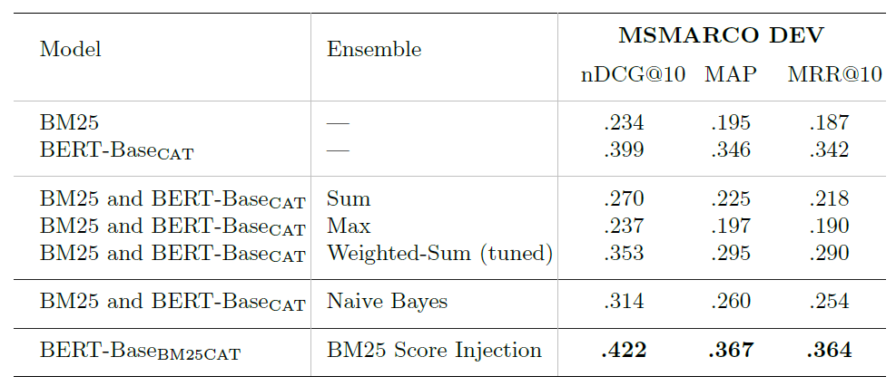
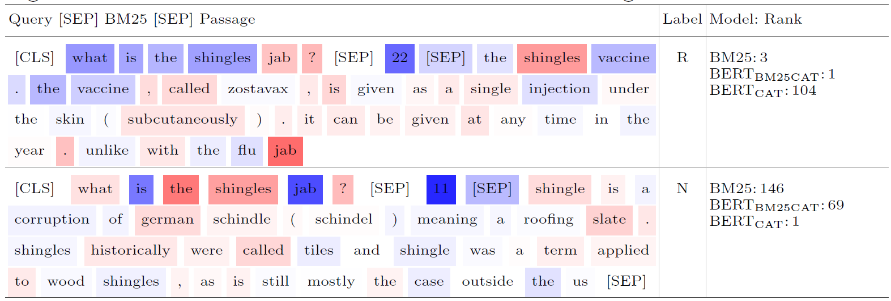

<!-- IL MANQUE le positionnement par rapport à l'etat de l’art -->
<!--
_class: lead
_paginate: false
-->

# Injecting the BM25 Score as Text Improves BERT-Based Re-rankers

---

<!-- 
_class: lead invert
_paginate: false
-->

# The basics

---

<!--
  _class: lead
-->

<!-- Décrire les Input - Output -->
# Cross-Encoder
Architecture classique d'un Cross-Encoder

--- 

# Re-Ranking
- **Ré-ordonner** les résultats
- Pipeline classique : 
  - Premier rank sur tout le corpus avec BM25 
    $\rightarrow$ Top 1000 de documents (pour chaque question)
  - Re-rank des 1000 documents avec un Cross-Encoder
- C'est **ce qui marche le mieux** actuellement 
  - MRR@10 : 39.02 % (MS Marco Dev)
  - nDCG@10 : 74.31 % (TRECL DL 19)

---

<!-- 
_class: lead invert
_paginate: false
-->

# Notre article

---

# Et si on réutilise le score BM25 ? 
- La méthode classique : combinaison linéaire du score CE et BM25
$\rightarrow$ Peut réduire les performances...
- Plus avancé : on combine des modèles... (Augmented SBERT : Cross-Encoder + Bi-Encoder)
- :sparkles: Notre méthode :sparkles:
<!-- - Autre méthode dans "Methods for combining rankers." Est-ce qu'on en parle vite fait ? Pour moi non faudrait aller lire les papiers cités -->

---

# Méthode proposée

  Les modèles BERT **savent capturer les chiffres**
  $\Rightarrow$ Et si on lui injecte directement le score ?

---

Problèmatiques :
1. Est-ce que ça marche ? À quel point ?
2. Et par rapport aux autres méthodes de combinaison de score classique ?

---

<!-- 
_class: lead invert
_paginate: false
-->

# Méthode

---

# Méthode : Injection du score 
<!-- Condition des expériences -->
- Le score BM25 est **non borné**, besoin de **normaliser** pour garder l'interprétation :
  - $Min-Max(S_{BM25}) = \frac{S_{BM25} - s_{min}}{ s_{max} - s_{min}}$
  - $Standard(S_{BM25}) = \frac{S_{BM25} - \mu(S)}{ \sigma(S) }$
  - $Sum(S_{BM25}) = \frac{S_{BM25}}{ sum(S)}$
- Deux manières de choisir les paramètres $s_{min}, s_{max}, \sigma(S), \mu(S)$ :
  - Local : calcul sur la "ranked list of scores per query"
  - Global : Respectivement $\{0, 50, 42, 6\}$ 
  <!-- Empirically suggested in prior work to be used as default values across different queries to globally normalize BM25 -->

---

# Méthode : Injection du score 
- Les modèles BERT ont des **difficultés à interpréter les flottants**
  $\Rightarrow$ Conversion en nombre entier
  $\Rightarrow$ Arrondi des flottants

---

# Méthode : Combinaison du score BM25 et du CE
- Grosse litérature sur comment combiner les scores
- Méthodes linéaires et non linéaires :
  - Somme : $s_{BM25} + s_{CE}$
  - Max : $\max(s_{BM25},\,s_{CE})$
  - Moyenne pondérée : $\alpha ~ s_{BM25} + (1 - \alpha) ~ s_{CE}$ 
  <!-- La moyenne pondéré : poids & score CE \in [0,1], BM25 normalisé avec min max -->

  <!-- Furthermore, we train ensemble models that take sBM 25 and sCECAT as features. We experiment with three different classifiers for this purpose: SVM with a linear kernel, SVM with an RBFkernel, Naive Bayes, and Multi Layer Perceptron (MLP) as a non-linear method and report the best classifier performance in Section ???????????? -->

---

# Méthode : protocole d'évaluation

- Évaluation sur :
  - MS Marco Dev (7000 queries)
  - TREC DL 19
  - TREC DL 20
- Métriques : 
  - MRR@10
  - nDCG@10
  - MAP
  - Ajout de notre part : Rappel@1000
---

<!-- 
_class: lead invert
_paginate: false
-->

# Résultats

---

<!-- Décrire les tableau de résultat  
- T-test entre baseline et condition 
- Paramètre global > local 
  -> Les document pertinents sont boostés avec les paramètres globaux (proche de 1)
  -> En local : les documents n°1 ont toujours un score de 1 même si leurs BM25 à l'origine n'était pas très haut
- int > float 
- Min max > Standard -> avec Standard il y a des score négatif
- Sum décroit les perf
- Ici la différence de perf est pas flagrante mais vous allez voir dans le tableau suivant que sur les autres datasets d'éval il y a quand même un beau boost *

parler des score pas ouf 
-->
<!-- Dire qu'on a directement utiliser le min max global pour passer au tableau suivant car c'est beaucoup trop long à train ptdr -->
### Effet de la normalisation sur le score

--- 

<!-- Décrire les tableau de résultats
- Utilisation du min max global
- Différent BERT (différence entre eux ? )
- Meilleurs résultat avec le BERT-Large
- MiniLM et autre bert résutlat similaire
comparaison avec cross encoder classique 
toujours mieux avec injection 
en terme de résultat global c'est le bert large 
-->
### Cross-Encoder classique vs :sparkles: le notre :sparkles:

---

<!-- Décrire les tableau de résultats
- Injection toujours mieux qu'une combinaison mathématique des deux scores
-->
### Comparaison avec les combinaisons linéaires classiques

<!-- Je skip la table suivante -->

---

<!-- Décrire les tableau de résultats
- Deux exemples de query et leur classement par un CE classique et un CE avec BM25
- Pour la première query qui est revelante ! 
  - BM25 le met en 3
  - CECAT en 1 
  - CE en 104 haiyaaa
- Pour la deuxième query qui est pas revelante 
  - BM25 le met en 146
  - CECAT en 69
  - CE en 1 haiyaaa 
- La couleur représente the word level attribution value en utilisant l'Integrated Gradient == une valeur de d'explicabilité calculé pour BM25CAT quoi 
- On voit que le modèle utilise le score BM25 bcp pour ne pas faire ls même erreur que le CE classique
- Ils ont fait pareil sur un plus gros set de query et en triant les valeur d'importance des mots, le score BM25 est en moyenne en 3ème position => le model l'utilise beaucoup pour prendre sa décision
-->
### Explicabilité du modèle

---

# Nos résultats...

|               | MRR@10 | MAP  | NDCG@10 | Recall@1000 |
|---------------|--------|------|---------|-------------|
| BM25          | .187   | .277 | .234    | .808        |
| Baseline      | .368   | .371 | .478    | .857        |
| Cross-Encoder | .254   | .261 | .380    | .857        |

Sûrement un problème dans l'apprentissage et de tuning de paramètres... :pensive:

---

# Forces et faiblesses de la contribution
- Injection du score : Facile et efficace
- Très lent (de base, il faut ici ajouter le calcul du score pour l'entrainement)...
<!-- Dans la pipeline classique BM25@1000 et rerank -->
- Possible sur n'importe quel Cross-Encoder

---

<!-- Avez-vous trouvé le papier facilement reproductible ? Quels ajustements ont été nécessaires ? Pour quelles raisons ? -->

# Nos remarques

- Matériel nécéssaire et temps de train des Cross Encoder assez conséquent
- Classe Cross-Encoder custom de celle de Sentence Transformer :
  - Boucle de fit qui log les loss (avec WandB :heart_eyes:)
  - Tokenizer pour input `[CLS] query [SEP] BM25 [SEP] passage [SEP]`
- Les challenges de ce projet : 
  - **Comprendre** et utiliser les datasets
  - Trouver une manière **efficace** de calculer BM25 sur le corpus
    - ~~À la main~~ ; ~~Elastic Search Docker~~ ; ~~Elastic Search Cloud~~ ; ~~Pyserini sur ppti-gpu~~
    - Pyserini en local $\rightarrow$ écriture du tsv $\rightarrow$ Transfert et lecture du ppti-gpu

---
<!-- 
_class: lead
_paginate: false
-->

# Merci
## Avez vous-des questions ?

---

<!-- 
_class: lead invert
_paginate: false
-->

# Notre ré-implémentation

---

# Code - Pyserini

Utilisation de [Pyserini](http://pyserini.io/) pour l'indexation, le calcul de BM25 et la récupération des documents.

$\Rightarrow$ Utilisation de plusieurs scripts `bash` :

- `prep.sh` qui convertit les documents de MSMARCO-Passage en `.json` pour l'indexation.
- `index.sh` pour indexer MSMARCO-Passage (8.8 millions de documents) (~ 5 minutes sur une bonne machine avec SSD).
- `baseline.sh` pour vérifier et reproduire les résultats de l'état de l'art (retrieval sur le dev).

--- 

# Code - Transformation des données

Pour pouvoir entraîner notre Cross-Encoder, on a besoin de calculer le score BM25 pour chaque paire (query, passage). Cela se fait *relativement* rapidement après avoir créé un index.

- `download_dataset.py`: explicite.
- `create_dataset.py` : 
  - Création du jeu d'entraînement avec un positive-to-negative ratio fixé à 4 (paramètre). ~45 minutes pour 20 millions de couples (query, passage). 
  - Création du jeu d'évaluation à partir d'un fichier BM25 retrieval de Pyserini (format `msmarco`). ~15 minutes pour le top 1000 des 6980 queries du `dev.small`.
- `load_dataset.py` : permet de charger le corpus, les queries, les données de train et d'eval d'une manière compréhensible par Python.

--- 

# Code - Entraînement du Cross-Encoder

Création d'une classe Cross-Encoder custom, basé sur la classe `CrossEncoder` de la librarie [`SentenceTransformers`](https://www.sbert.net/index.html). La classe est dans `crossencoder_bm25.py`.

Adaptation de la boucle d'apprentissage : ajout d'un early-stopping, ajout d'un callback (pour log), calcul d'un MRR@10 pendant le train.

Adapation du tokenizer pour le train et la prédiction : sinon, on n'a pas `[CLS] query [SEP] score [SEP] passage [SEP]`.

Ensuite on charge nos données avec les fonctions précédentes et on attend ~13 heures le temps d'apprentissage du modèle (pour une époque).

---

# Code - Evaluation du Cross-Encoder

Et enfin, on peut évaluer. Il faut donc charger les données retrieve par BM25 puis prédire avec le Cross-Encoder (~2 heures pour 6980 queries TOP 1000), avant de réordonner le tout puis calculer les métriques (MRR@10, MAP, nDCG, PR) avec Pyserini avec le script `eval.sh`. On calcule ces métriques en créant un fichier sous format `msmarco` à partir des prédictions.

L'évaluation est disponible dans un notebook Jupyter `eval_bm25.ipynb`. Il y a le même notebook `eval_bm25_baseline.ipynb` pour la baseline sur un Cross-Encoder classique pré-entrainé par nos soins également.

Il y a également un notebook `eval_bm25_comparison.ipynb` pour comparer le modèle avec un modèle où l'on retrieve d'abord avec un Bi-Encoder puis qu'on re-rank avec notre Cross-Encoder custom.